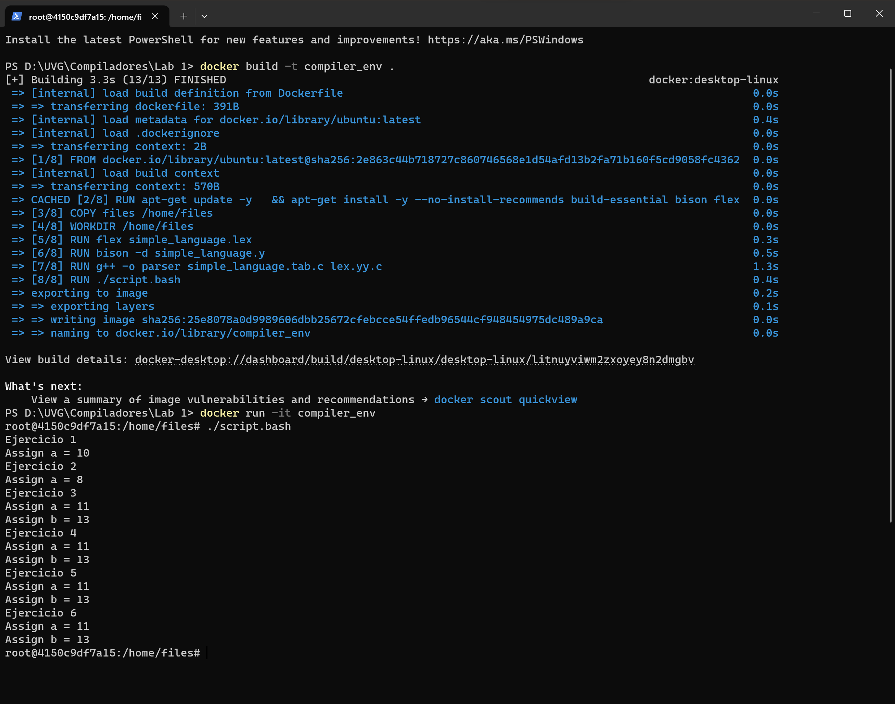

## Alejandro Martinez 21430
### 1. Cree un programa que asigne un valor a una variable.
### 2. Cree un programa que realice una operacion aritmetica simple.
### 3. Experimente con expresiones mas complejas y verifique que el compilador las procese correctamente.
### 4. Modifique el lenguaje para incluir la asignacion de variables con expresiones aritmeticas.
### 5. Agregue manejo de errores al compilador para detectar tokens invalidos en el programa fuente.
[simple_language.y](./files/simple_language.y)
```cpp
inline void yyerror(const char *str) {
	std::cerr << "Error: " << str << std::endl;
}
```
### 6. Experimente con la precedencia de operadores en el lenguaje y observe como afecta la generacion del arbol sintactico.
[simple_language.y](./files/simple_language.y)
```
%left y %right en simple_language.y.

Por ejemplo: %left '+' '-' indica que la suma y la resta tienen la misma precedencia y son asociativas de izquierda a derecha.
```

