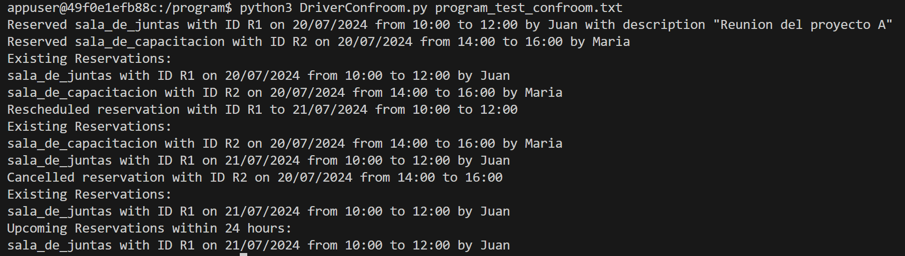

# Alejandro Martínez - 21430
# Samuel Argueta - 211024

<i>[GRAMMAR.g4](./program/ConfRoomScheduler.g4)</i>

<i>[LISTENER.py](./program/ConfRoomSchedulerListener.py)</i>

```
antlr -Dlanguage=Python3 ConfRoomScheduler.g4 
python3 DriverConfroom.py program_test_confroom.txt
```

## Results
<i>[TEST.txt](./program/program_test_confroom.txt)</i>



## 1. Cree un programa que reserve una sala de conferencias.
Modificacion
**ya existia, no es necesario modificar*
```python
reserve: 'RESERVAR' ID 'PARA' DATE 'DE' TIME 'A' TIME ;
```
Test
```python
RESERVAR sala101 PARA 12/12/2024 DE 07:00 A 08:00
```
## 2. Cree un programa que cancele una reserva de sala de conferencias.
Modificacion
**ya existia, no es necesario modificar*
```python
cancel: 'CANCELAR' ID 'PARA' DATE 'DE' TIME 'A' TIME ;
```
Test
```python
CANCELAR sala101 PARA 12/12/2024 DE 07:00 A 08:00
```
## 3. Experimente con varias reservas y cancelaciones en un mismo programa.
Test
```python
RESERVAR sala101 PARA 12/12/2024 DE 07:00 A 08:00
CANCELAR sala101 PARA 12/12/2024 DE 07:00 A 08:00
RESERVAR sala102 PARA 01/10/2023 DE 10:00 A 12:00
```
## 4. Modifique el DSL para incluir el nombre del solicitante de la reserva.
Modificacion
```python
reserve: 'RESERVAR' ID 'PARA' DATE 'DE' TIME 'A' TIME 'POR' NAME ; 
NAME: [a-zA-Z]+ ; 
```
Test
```python
RESERVAR sala101 PARA 12/12/2024 DE 07:00 A 08:00 POR Alejandro
```
## 5. Agregue manejo de errores para detectar fechas u horas invalidas.
Modificacion
```python
def enterReserve(self, ctx:ConfRoomSchedulerParser.ReserveContext):
	try:
		room_type = ctx.ROOMTYPE().getText()
		res_id = ctx.ID().getText()
		date = ctx.DATE().getText()
		start_time = ctx.TIME(0).getText()
		end_time = ctx.TIME(1).getText()
		applicant = ctx.NAME().getText()
		description = ctx.DESCRIPTION().getText() if ctx.DESCRIPTION() else None

		# Validate date and time formats
		res_date = datetime.strptime(date, "%d/%m/%Y")
		res_start = datetime.strptime(f"{date} {start_time}", "%d/%m/%Y %H:%M")
		res_end = datetime.strptime(f"{date} {end_time}", "%d/%m/%Y %H:%M")

		# Check for invalid times
		if res_start >= res_end:
			print(f"Error: Start time must be before end time for reservation {res_id}")
			return

		if date not in self.reservations:
			self.reservations[date] = []

		self.reservations[date].append({
			'id': res_id,
			'room_type': room_type,
			'start_time': start_time,
			'end_time': end_time,
			'applicant': applicant,
			'description': description
		})
		print(f"Reserved {room_type} with ID {res_id} on {date} from {start_time} to {end_time} by {applicant}" + (f" with description {description}" if description else ""))

	except ValueError as e:
		print(f"Error: Invalid date or time format in reservation {res_id}")
```
## 6. Cree un programa que incluya reservas solapadas y verifique su manejo (para validar reservaciones traslapadas, use un listener de ANTLR en Python; el listener llevara la cuenta de las reservaciones y validara cada nueva reservacion en contra de las existentes).
Modificacion
```python
def enterReserve(self, ctx:ConfRoomSchedulerParser.ReserveContext):
	try:
		room_type = ctx.ROOMTYPE().getText()
		res_id = ctx.ID().getText()
		date = ctx.DATE().getText()
		start_time = ctx.TIME(0).getText()
		end_time = ctx.TIME(1).getText()
		applicant = ctx.NAME().getText()
		description = ctx.DESCRIPTION().getText() if ctx.DESCRIPTION() else None

		# Validate date and time formats
		res_date = datetime.strptime(date, "%d/%m/%Y")
		res_start = datetime.strptime(f"{date} {start_time}", "%d/%m/%Y %H:%M")
		res_end = datetime.strptime(f"{date} {end_time}", "%d/%m/%Y %H:%M")

		# Check for invalid times
		if res_start >= res_end:
			print(f"Error: Start time must be before end time for reservation {res_id}")
			return

		# Check for overlapping reservations
		for res in self.reservations[date]:
			if res['id'] == res_id and self.is_overlap(start_time, end_time, res['start_time'], res['end_time']):
				print(f"Error: Overlapping reservation for ID {res_id} on {date}")
				return

		self.reservations[date].append({
			'id': res_id,
			'room_type': room_type,
			'start_time': start_time,
			'end_time': end_time,
			'applicant': applicant,
			'description': description
		})
		print(f"Reserved {room_type} with ID {res_id} on {date} from {start_time} to {end_time} by {applicant}" + (f" with description {description}" if description else ""))

	except ValueError as e:	
		print(f"Error: Invalid date or time format in reservation {res_id}")

def enterCancelStat(self, ctx:ConfRoomSchedulerParser.CancelStatContext):
	room_id = ctx.ID().getText()
	date = ctx.DATE().getText()
	start_time = ctx.TIME(0).getText()
	end_time = ctx.TIME(1).getText()
	requester = ctx.NAME().getText()

	# Find and remove the reservation
	self.reservations = [res for res in self.reservations if not (res['room_id'] == room_id and res['date'] == date and res['start_time'] == start_time and res['end_time'] == end_time and res['requester'] == requester)]
```
## 7. Extienda el DSL para soportar descripciones de eventos.
Modificacion
```python
reserve: 'RESERVAR' ROOMTYPE ID 'PARA' DATE 'DE' TIME 'A' TIME 'POR' NAME ( 'DESCRIPCION' DESCRIPTION )? ; 
DESCRIPTION: '"' .*? '"' ; 
```
Test
```python
RESERVAR sala_de_juntas R1 PARA 20/07/2024 DE 10:00 A 12:00 POR Juan DESCRIPCION "Meeting"
```
## 8. Agregue validaciones adicionales como restricciones de tiempo de uso maximo.
Modificacion
```python
def enterReserve(self, ctx:ConfRoomSchedulerParser.ReserveContext):
	try:
		room_type = ctx.ROOMTYPE().getText()
		res_id = ctx.ID().getText()
		date = ctx.DATE().getText()
		start_time = ctx.TIME(0).getText()
		end_time = ctx.TIME(1).getText()
		applicant = ctx.NAME().getText()
		description = ctx.DESCRIPTION().getText() if ctx.DESCRIPTION() else None

		# Validate date and time formats
		res_date = datetime.strptime(date, "%d/%m/%Y")
		res_start = datetime.strptime(f"{date} {start_time}", "%d/%m/%Y %H:%M")
		res_end = datetime.strptime(f"{date} {end_time}", "%d/%m/%Y %H:%M")

		# Check for invalid times
		if res_start >= res_end:
			print(f"Error: Start time must be before end time for reservation {res_id}")
			return

		# Check for maximum reservation duration
		if (res_end - res_start).total_seconds() > self.MAX_RESERVATION_HOURS * 3600:
			print(f"Error: Reservation {res_id} exceeds maximum allowed duration of {self.MAX_RESERVATION_HOURS} hours")
			return

		if date not in self.reservations:
			self.reservations[date] = []

		# Check for overlapping reservations
		for res in self.reservations[date]:
			if res['id'] == res_id and self.is_overlap(start_time, end_time, res['start_time'], res['end_time']):
				print(f"Error: Overlapping reservation for ID {res_id} on {date}")
				return

		self.reservations[date].append({
			'id': res_id,
			'room_type': room_type,
			'start_time': start_time,
			'end_time': end_time,
			'applicant': applicant,
			'description': description
		})
		print(f"Reserved {room_type} with ID {res_id} on {date} from {start_time} to {end_time} by {applicant}" + (f" with description {description}" if description else ""))

	except ValueError as e:
		print(f"Error: Invalid date or time format in reservation {res_id}")
```
## 9. Implemente una funcionalidad para listar las reservas existentes.
Modificacion
```python
def enterList(self, ctx:ConfRoomSchedulerParser.ListContext):
	print("Existing Reservations:")
	for date, reservations in self.reservations.items():
		for res in reservations:
			print(f"{res['room_type']} with ID {res['id']} on {date} from {res['start_time']} to {res['end_time']} by {res['applicant']}")

```
## 10. Cree un programa que utilice todas las caracterısticas extendidas del DSL.
Test
```python
RESERVAR sala101 PARA 15/07/2024 DE 09:00 A 11:00 SOLICITADO_POR Juan DESCRIPCION Reunión de equipo
RESERVAR sala102 PARA 16/07/2024 DE 10:00 A 12:00 SOLICITADO_POR María DESCRIPCION Taller de capacitación
CANCELAR sala101 PARA 15/07/2024 DE 09:00 A 11:00 SOLICITADO_POR Juan
```
## 11. Añada soporte para diferentes tipos de salas (por ejemplo, sala de juntas, sala de capacitacion).
Modificacion
```python
reserve: 'RESERVAR' ROOMTYPE ID 'PARA' DATE 'DE' TIME 'A' TIME 'SOLICITADO_POR' NAME 'DESCRIPCION' DESCRIPTION ;
ROOMTYPE: 'sala_de_juntas' | 'sala_de_capacitacion' ;
```
Test
```python
RESERVAR sala_de_capacitacion R2 PARA 20/07/2024 DE 14:00 A 16:00 POR Maria
```
## 12. Implemente un sistema de notificaciones para reservas proximas.
Modificacion
```python
def enterNotify(self, ctx:ConfRoomSchedulerParser.NotifyContext):
	from datetime import datetime, timedelta
	current_time = datetime.now()
	upcoming_time = current_time + timedelta(hours=24)
	print("Upcoming Reservations within 24 hours:")
	res_count = 0
	for date, reservations in self.reservations.items():
		for res in reservations:
			res_start = datetime.strptime(f"{date} {res['start_time']}", "%d/%m/%Y %H:%M")
			if current_time <= res_start <= upcoming_time:
				res_count += 1
				print(f"{res['room_type']} with ID {res['id']} on {date} from {res['start_time']} to {res['end_time']} by {res['applicant']}")
	if (res_count == 0):
		print("None")
```
## 13. Extienda el DSL para permitir la reprogramacion de reservas.
Modificacion
```python
reschedule: 'REPROGRAMAR' ID 'DE' DATE 'A' DATE 'DE' TIME 'A' TIME 'SOLICITADO_POR' NAME ;
```
Test
```python
RESERVAR sala_de_juntas R1 PARA 20/07/2024 DE 10:00 A 12:00 POR Juan DESCRIPCION "Reunion del proyecto A"
REPROGRAMAR R1 DE 20/07/2024 A 21/07/2024 DE 10:00 A 12:00
```
## 14. Cree un programa que reprograme una reserva existente y valide el cambio (para validar reservaciones traslapadas, use un listener de ANTLR en Python que ya creo en una actividad anterior; el listener llevara la cuenta de las reservaciones y validara cada nueva reservacion en contra de las existentes).
Modificacion
```python
def enterReschedule(self, ctx:ConfRoomSchedulerParser.RescheduleContext):
	try:
		res_id = ctx.ID().getText()
		old_date = ctx.DATE(0).getText()
		new_date = ctx.DATE(1).getText()
		new_start_time = ctx.TIME(0).getText()
		new_end_time = ctx.TIME(1).getText()

		# Validate date and time formats
		old_res_date = datetime.strptime(old_date, "%d/%m/%Y")
		new_res_date = datetime.strptime(new_date, "%d/%m/%Y")
		new_res_start = datetime.strptime(f"{new_date} {new_start_time}", "%d/%m/%Y %H:%M")
		new_res_end = datetime.strptime(f"{new_date} {new_end_time}", "%d/%m/%Y %H:%M")

		# Check for invalid times
		if new_res_start >= new_res_end:
			print(f"Error: Start time must be before end time for rescheduled reservation {res_id}")
			return

		# Check for maximum reservation duration
		if (new_res_end - new_res_start).total_seconds() > self.MAX_RESERVATION_HOURS * 3600:
			print(f"Error: Rescheduled reservation {res_id} exceeds maximum allowed duration of {self.MAX_RESERVATION_HOURS} hours")
			return

		# Find and remove the old reservation
		if old_date in self.reservations:
			old_res = None
			for res in self.reservations[old_date]:
				if res['id'] == res_id:
					old_res = res
					break
			if old_res:
				self.reservations[old_date].remove(old_res)
			else:
				print(f"Error: No reservation found with ID {res_id} on {old_date}")
				return
		else:
			print(f"Error: No reservation found with ID {res_id} on {old_date}")
			return

		if new_date not in self.reservations:
			self.reservations[new_date] = []

		# Check for overlapping reservations
		for res in self.reservations[new_date]:
			if res['id'] == res_id and self.is_overlap(new_start_time, new_end_time, res['start_time'], res['end_time']):
				print(f"Error: Overlapping reservation for ID {res_id} on {new_date}")
				return

		self.reservations[new_date].append({
			'id': res_id,
			'room_type': old_res['room_type'],
			'start_time': new_start_time,
			'end_time': new_end_time,
			'applicant': old_res['applicant'],
			'description': old_res['description']
		})
		print(f"Rescheduled reservation with ID {res_id} to {new_date} from {new_start_time} to {new_end_time}")

	except ValueError as e:
		print(f"Error: Invalid date or time format in rescheduling reservation {res_id}")
```