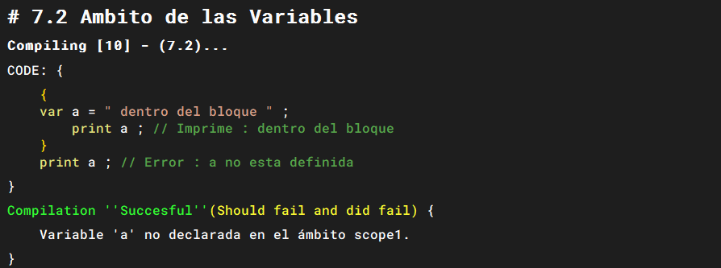
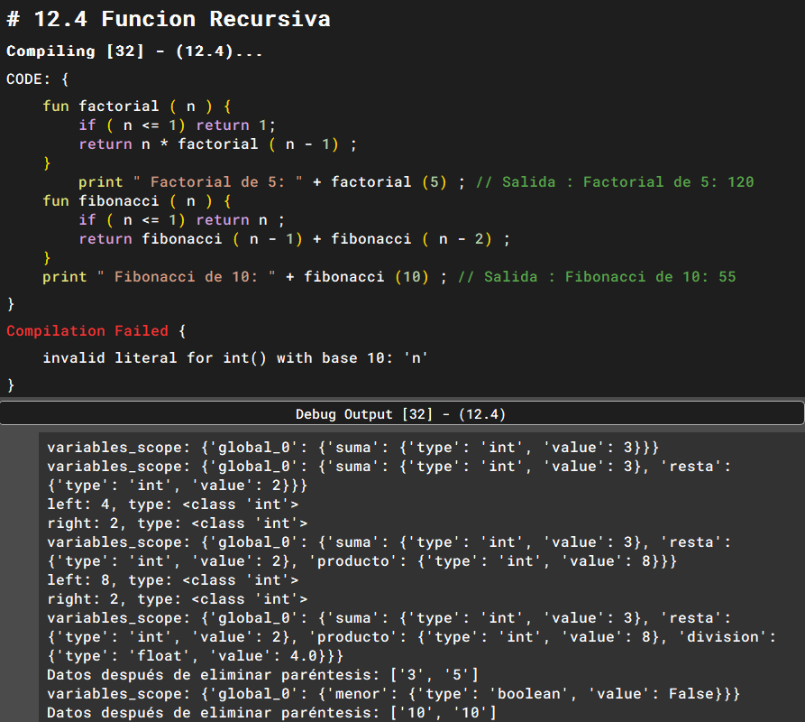

# Run

## Dependencies:
```bash
pip install antlr4-python3-runtime
pip install graphviz
pip install PyQt6
```

## Launch:
#### IDE Compiler:
```bash
python3 Main.py
```
#### Pre-Made Tests:
```bash
python3 Test.py
```
Arguments:
```python
--render=BOOL: Union [ True | False ] # (Optional) Whether to Save The Syntax Tree(s) to a png.

Example: "python3 Test.py --render=False"
```
# Architecture
The [Semantic Analyzer](Semantic_Analyzer.py) Is the implementation of the ANTLR Visitor class. It contains all relevant data to track scopes, build maps and eventulally generate the [Symbol Table](Symbol_Table.py).

The [Main](Main.py) file contains the GUI initialization. The GUI itself contains:
* A Text Editor with Syntax Highlighting to input the code.
* A Log with all relevant information to the backend and what the compiler is doing.
* Three symbol tables for Functions, Variables and Classes contained in different tabs.
* The String Tree Output of the Generated Syntax

On compilation, the code will be submitted and preprocessed with the [Compiscript Lexer](CompiscriptLexer.py), which then passes through the [Compiscript Parser](CompiscriptParser.py) to generate the [Syntax Tree](Output/Syntax-Graph.png). This Syntax Tree then passes to the [Semantic Analyzer](Semantic_Analyzer.py) which visits every node, generating all the aformentioned data to finally be displayed on the GUI.

# CompiScript and Semantic Analisis Examples
For all examples, Run:
* `python Test.py`

Inputs:
* [Unit Tests](Tests/Small_Tests.py)
* [Comprehensive Tests](Tests/Large_Tests.py)

Example Outputs:
## Success

## Success

## Success (With Warning For Failure)

## Failure
